<div align="center">

<a href="https://praha-inc.github.io/byethrow/">
  <picture>
    <source media="(prefers-color-scheme: dark)" srcset="./.github/assets/banner-dark.svg">
    <source media="(prefers-color-scheme: light)" srcset="./.github/assets/banner-light.svg">
    
  </picture>
</a>

[](https://github.com/praha-inc/byethrow/blob/main/LICENSE)
[](https://github.com/orgs/praha-inc/followers)

[Documentation](https://praha-inc.github.io/byethrow/) · [Quick Start](https://praha-inc.github.io/byethrow/guide/start/quick) · [Examples](https://praha-inc.github.io/byethrow/examples/parse-package-json) · [API Reference](https://praha-inc.github.io/byethrow/api/modules/Result)

</div>

## Introduction

`@praha/byethrow` is a lightweight, tree-shakable Result type package with a simple, consistent API designed to handle fallible operations in JavaScript and TypeScript. It provides a straightforward way to manage errors and results without the complexity of larger libraries. For a usage guide, visit the [official documentation](https://praha-inc.github.io/byethrow/).

## Structure

| Package Name                                  | Version                                                                                                                         | Description           | Changelog                                   |
|-----------------------------------------------|---------------------------------------------------------------------------------------------------------------------------------|-----------------------|---------------------------------------------|
| [`@praha/byethrow`](packages/byethrow)        | [](https://www.npmjs.com/package/@praha/byethrow)                 | Core package          | [CHANGELOG](packages/byethrow/CHANGELOG.md) |
| [`@praha/byethrow-docs`](packages/docs)       | [](https://www.npmjs.com/package/@praha/byethrow-docs)       | Documentation package | [CHANGELOG](packages/docs/CHANGELOG.md)     |
| [`@praha/byethrow-oxlint`](packages/oxlint)   | [](https://www.npmjs.com/package/@praha/byethrow-oxlint)   | Oxlint plugin package | [CHANGELOG](packages/oxlint/CHANGELOG.md)   |
| [`@praha/byethrow-testing`](packages/testing) | [](https://www.npmjs.com/package/@praha/byethrow-testing) | Testing package       | [CHANGELOG](packages/testing/CHANGELOG.md)  |

## 🤝 Contributing

Contributions, issues and feature requests are welcome.

Feel free to check [issues page](https://github.com/praha-inc/byethrow/issues) if you want to contribute.

## 📝 License

Copyright © [PrAha, Inc.](https://www.praha-inc.com/)

This project is [```MIT```](https://github.com/praha-inc/byethrow/blob/main/LICENSE) licensed.
